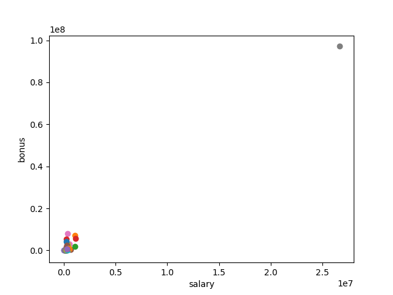
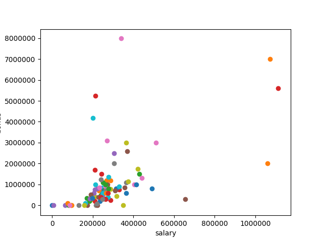
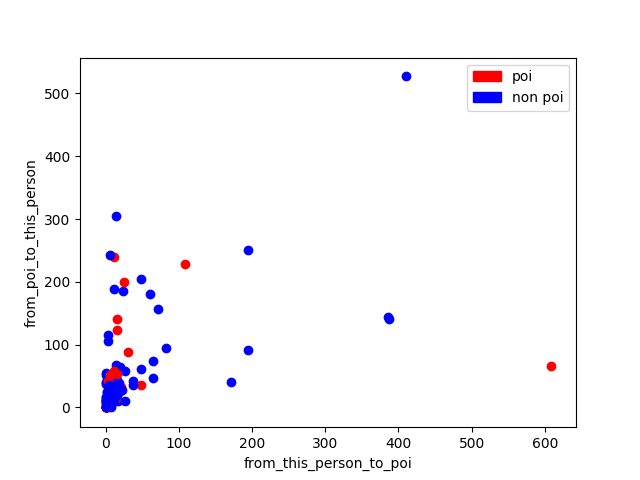
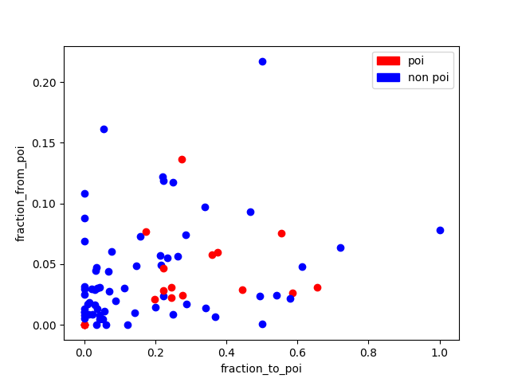
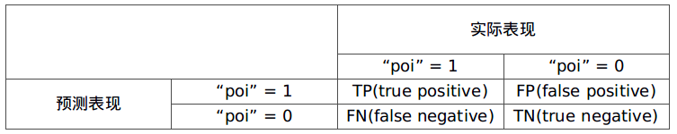

---
output:
  word_document: default
  pdf_document: default
  html_document: default
---
# 从安然公司邮件中发现欺诈证据

## 项目背景

安然在2001年宣告破产之前，安然拥有约21000名雇员，是世界上最大的电力、天然气以及电讯公司之一，2000年披露的营业额达1010亿美元之巨。 2002 年，由于其存在大量的企业欺诈行为，这个昔日的大集团以极快的速度土崩瓦解。 在随后联邦进行的调查过程中，大量有代表性的保密信息进入了公众的视线，包括成千上万涉及高管的邮件和详细的财务数据。

## 目标

本项目中，我将根据安然丑闻中公开的财务和邮件数据来构建相关人士识别符“person of interest identifier”。利用机器学习算法进行数据分析，从邮件和财务数据中找出犯罪嫌疑人。

本项目提供了可读入数据的初始代码，可以将我选择的特征放入 numpy 数组中，该数组是大多数 sklearn 函数假定的输入表单。 我要做的就是设计特征，选择并调整算法，用以测试和评估识别符。

## 理解数据集和问题

### 数据探索


- 数据预处理

在预处理此项目时，已将安然邮件和财务数据与字典结合在一起，字典中的每对键值对应一个人。 字典键是人名，值是另一个字典（包含此人的所有特征名和对应的值）。 数据中的特征分为三大类，即财务特征、邮件特征和 POI 标签。

- 数据点总数

本数据集的总点数为146个，即是146人。

调查长度比较长的人名时，我发现了一个人名是"THE TRAVEL AGENCY IN THE PARK"，显然不是一个人，可能会影响我后续的分析，我决定将该数据点删除。

- 数据中的特征和标签

财务特征、邮件特征和 POI 标签。统计得，每个人有20个特征。

财务特征: ['salary', 'deferral_payments', 'total_payments', 'loan_advances', 'bonus', 'restricted_stock_deferred', 'deferred_income', 'total_stock_value', 'expenses', 'exercised_stock_options', 'other', 'long_term_incentive', 'restricted_stock', 'director_fees'] (单位均是美元）

邮件特征: ['to_messages', 'email_address', 'from_poi_to_this_person', 'from_messages', 'from_this_person_to_poi', 'shared_receipt_with_poi'] (单位通常是电子邮件的数量，明显的例外是 ‘email_address’，这是一个字符串）

POI 标签: [‘poi’] (boolean，整数)

我打印了第一个人的名称及其特征和标签作为参考:

```python
METTS MARK {'salary': 365788, 'to_messages': 807, 'deferral_payments': 'NaN', 'total_payments': 1061827, 'exercised_stock_options': 'NaN', 'bonus': 600000, 'restricted_stock': 585062, 'shared_receipt_with_poi': 702, 'restricted_stock_deferred': 'NaN', 'total_stock_value': 585062, 'expenses': 94299, 'loan_advances': 'NaN', 'from_messages': 29, 'other': 1740, 'from_this_person_to_poi': 1, 'poi': False, 'director_fees': 'NaN', 'deferred_income': 'NaN', 'long_term_incentive': 'NaN', 'email_address': 'mark.metts@enron.com', 'from_poi_to_this_person': 38}
```

- 在安然数据中查找POI

POI 即是”Person of Interest“嫌疑犯的缩写。“POI”为1即是此人为嫌疑人，“POI”为0即是此人不是嫌疑人。统计可得安然数据集中POI的总数为18。

- 安然数据中的特征的缺失值

对于数据集中的所有人，不是每一个特征都有值。当特征没有明确的值时，用“NaN”来表示。统计得146人中有95人有量化的工资“salary”，其他为“NaN”。有111人已知的邮箱地址“email_address”为可用，其他为“NaN”。

调查发现安然数据中存在一个人“LOCKHART EUGENE E”的所有特征值都为“NaN”，没有研究价值，我觉定将它移除。

### 异常值调查

一般数据都是“dirty”的，异常值也很常见，异常值可能对以后的分析造成很大的影响，可视化是查询异常值的有效方法，我便将打印出"salary"和"bonus"的散点图，并发现了一个明显的异常值点（如下图所示），该异常值点的薪水和奖金的值都异常大，远远超过了其他所有人。



于是，我打印出了这个最大异常值对应的数据点的人名，是‘TOTAL’，我决定清除掉，因为它是一个电子表格 bug，是电子表格统计所得的结果，而非是一个人，对我们查找嫌疑人没有帮助。通过下面一行代码，我从字典中快速删除键值对。并再次绘制散点图。

```python
data_dict.pop('TOTAL',0)
```



第二次绘制的散点图中我发现了4个疑是异常值，其中有两人获得了至少 5 百万美元的奖金，以及超过 1 百万美元的工资；换句话说，他们就像是强盗。于是我将和这些点相关的名字打印出来，是“LAY KENNETH L”和“SKILLING JEFFREY K”，他们分别是安然公司的主席和CEO，他们数据的异常有利于我们查找出嫌疑人，应该保留。

## 优化特征选择/工程

### 创建新特征

可视化特征'from_this_person_to_poi'，'from_poi_to_this_person'和’poi’标签。



从上图我发现，根据雇员收到嫌疑人和发送给嫌疑人的邮件数目并不能很好判断其是否为嫌疑人，我利用每个人'from_this_person_to_poi'，'from_poi_to_this_person'，'to_messages'， 'from_messages'的这四个特征创建了新特征，雇员收到和发送嫌疑人邮件百分比"fraction_to_poi"，"fraction_from_poi"，百分比值越高，该雇员是嫌疑人的几率越大，能帮助我们更好的找到嫌疑人。将新特征进行可视化也验证了我的想法。



其中有嫌疑人对应的百分比值非常小，将其打印出来，发现是由于数据缺失造成的。

### 明智地选择特征

通过SelectKBest特征选择，被选择的特征有'salary', 'deferral_payments', 'total_payments', 'loan_advances', 'bonus', 'restricted_stock_deferred',  'deferred_income', 'total_stock_value', 'expenses', 'exercised_stock_options', 'other', 'long_term_incentive', 'restricted_stock', 'director_fees',  'shared_receipt_with_poi', 'fraction_to_poi', 'fraction_from_poi'
共17个特征（目前特征共21+2 （新）= 23个），被排除的特征及原因，‘poi’标签，它是作为验证机器学习成果的答案而不是机器学习的特征。‘email_address’，雇员的邮箱地址并无法给我们判断嫌疑人提供帮助。 'from_this_person_to_poi'，'from_poi_to_this_person'，'to_messages'， 'from_messages'，这4个特征被更能表达出雇员与嫌疑人之间的关系的特征 'fraction_to_poi', 'fraction_from_poi'所取代。根据SelectKBest提供的特征得分，选取5个得分最高，最好的特征。

```python
5 best features & scores: [('exercised_stock_options', 24.815079733218194), ('total_stock_value', 24.18289867856688), ('bonus', 20.792252047181535), ('salary', 18.289684043404513), ('fraction_to_poi', 16.409712548035785)]
```

### 特征缩放

由于特征缩放不会对我采用的朴素贝叶斯和决策树造成影响，故不采用特征缩放。


## 选择、调整算法和验证评估


对邮件信息的学习过程属于有监督的分类的机器学习的过程，于是我采用了朴素贝叶斯和决策树对模型进行训练和预测，并对预测的结果进行评估。评估采用了precision（TP/(TP+FP)）和recall（TP/(TP+FN)）两个指标，原因是本数据集嫌疑人和非嫌疑人人数差距大，数据不平衡，如下图所示，将人数较多的TN（true negative）排除在外的指标能更好的反映算法的性能。



如上图所示precision = TP/(TP+FP) = 预测正确的嫌疑人占总预测的嫌疑人的比例，recall = TP/(TP+FN) = 预测正确的嫌疑人占真正的嫌疑人的比例。

### 验证

验证是机器学习比不可少的环节，我们用不同的算法对训练集建立了模型，需要用测试集进行验证，通过验证可以试出自己的算法的学习成果、算法是否过拟合，并可以知道其泛化能力。机器学习本身也是一个不断学习、验证、调整的循环过程，最终达到需要的指标（如精确度、召回率）。验证中典型的错误是没有将数据拆成训练集和测试集。无验证的机器学习容易导致过拟合。通过train_test_split，将数据集分为70%训练集和30%测试集，便于下面对算法进行训练和验证。

```python
from sklearn.cross_validation import train_test_split
features_train, features_test, labels_train, labels_test = \
    train_test_split(features_selected, labels,
                     test_size=0.3, random_state=42)
```


### 决策树算法、参数调整及其验证评估

参数调整及其重要性：同一算法如决策树，采用不用的参数数值如min_samples_split时会得到不同的精确度和召回率，而参数调整就是要帮助我们找到适合的参数值使得算法的精确度和召回率达到最高，即是最好的评估结果。我采用了GridSearchCV对决策数的参数调整进行交叉验证，GridSearchCV 用于系统地遍历多种参数组合，通过交叉验证确定最佳效果参数。它的好处是，只需增加几行代码，就能遍历多种组合。

- 决策树算法、参数调整

```python
from sklearn.metrics import recall_score
from sklearn.metrics import precision_score
from sklearn.model_selection import GridSearchCV
from sklearn.tree import DecisionTreeClassifier
clf = DecisionTreeClassifier()
parameters = {"min_samples_split": range(5, 80, 5)}
clf = GridSearchCV(clf, parameters)
clf.fit(features_train, labels_train)
clf = clf.best_estimator_
print "Decision Tree best_estimator_"
print clf
print
pred = clf.predict(features_test)
print "Decision Tree algorithm performance:"
print "recall score:", recall_score(labels_test, pred, average="micro")
print "precision score:", precision_score(labels_test, pred, average="micro")
print
```
(average="micro": calculate metrics glabally by counting the total true positive, false negative, and false positive.)

- 参数调整最优分类器的结果：

```python
DecisionTreeClassifier(class_weight=None, criterion='gini', max_depth=None,
            max_features=None, max_leaf_nodes=None,
            min_impurity_decrease=0.0, min_impurity_split=None,
            min_samples_leaf=1, min_samples_split=70,
            min_weight_fraction_leaf=0.0, presort=False, random_state=None,
            splitter='best')
```

- poi_id.py验证评估

```python
Decision Tree algorithm performance:
recall score: 0.883720930233
precision score: 0.883720930233
```
性能分析：决策树算法的召回率为0.884，精确度为0.884，造成召回率和精确度值相等的原因是本数据集数据点较少。

- tester.py验证评估

```python
DecisionTreeClassifier(class_weight=None, criterion='gini', max_depth=None,
            max_features=None, max_leaf_nodes=None,
            min_impurity_decrease=0.0, min_impurity_split=None,
            min_samples_leaf=1, min_samples_split=70,
            min_weight_fraction_leaf=0.0, presort=False, random_state=None,
            splitter='best')
	Accuracy: 0.83400	Precision: 0.15678	Recall: 0.03700	F1: 0.05987	F2: 0.04367
	Total predictions: 14000	True positives:   74	False positives:  398	False negatives: 1926	True negatives: 11602
```

### 朴素贝叶斯算法（最终选择的算法）及其验证评估

- 朴素贝叶斯算法

```python
from sklearn.naive_bayes import GaussianNB
clf = GaussianNB()
clf.fit(features_train, labels_train)
pred = clf.predict(features_test)
print "Naive Bays algorithm performance:"
print "recall score:", recall_score(labels_test, pred, average="micro")
print "precision score:", precision_score(labels_test, pred, average="micro")
print
```

- poi_id.py验证评估

```python
Naive Bays algorithm performance:
recall score: 0.906976744186
precision score: 0.906976744186
```
性能分析：朴素贝叶斯算法的召回率为0.907，精确度为0.907，其召回率和精确度都比决策树高。

- tester.py验证评估

```python
GaussianNB(priors=None)
	Accuracy: 0.85629	Precision: 0.49545	Recall: 0.32650	F1: 0.39361	F2: 0.35040
	Total predictions: 14000	True positives:  653	False positives:  665	False negatives: 1347	True negatives: 11335
```

通过对比，朴素贝叶斯的算法在安然数据集上表现的性能更好， 故最终采用朴素贝叶斯。
